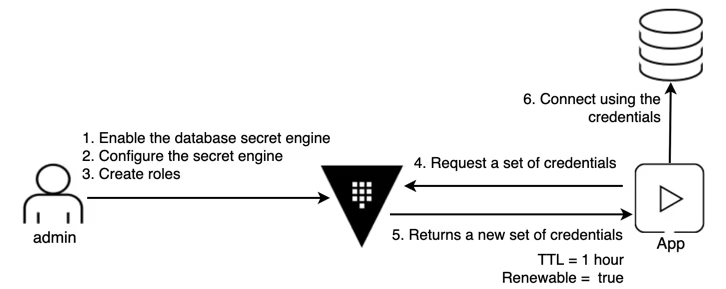

Здесь описывается основной функционал и критерии приемки

### Authentication method
**Approle**
Когда использовать: основной способ аутентификация сервисов (m2m)
Критерии приемки и рекомедации внедрения:
- рекомендуется использовать wrapped token (wrap_ttl)
- сформирована политика на чтение secretID
- roleID не являтся секретом, допускается хранение в переменных окружения
- рекомедуется доставка roleID и SecretID разными каналами DevOps
- рекомендуется использование secretid_bound_cidrs для указания диапазона IP 
Риски: 

**JWT**
Когда использовать: существует провайдер IdP JWT который выдает токен для АС клиента и существует интеграция настроек между JWT IdP и Vault
Критерии приемки и рекомедации внедрения:
Для токена обязательное выставление параметров:
    - ttl
    - explicit_ttl
    - num_uses
    - policies
- передача токена 
Риски: 

**Userpas**
Когда использовать: аутентификация пользователей в системе
Критерии приемки и рекомедации внедрения: Сформировать политику безопасности паролей (сложность, срок действия)
Риски: невозможно гарантировать безопасность пароля

### Secret Engine
**Database**

Когда использовать:
Критерии приемки и рекомедации внедрения:
Риски: 